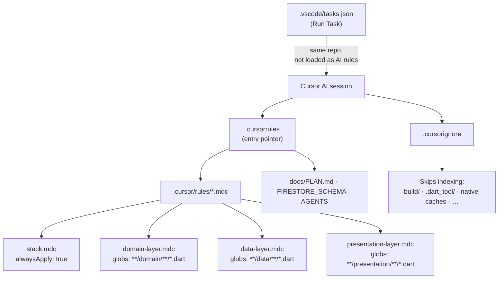

# shopping_list

An app for creating shared shopping lists and tracking household stock, with an (upcoming) usage prediction system.

## What’s implemented (plan-driven)
The project follows `docs/PLAN.md` stage-by-stage:
- MVP: shopping lists + cloud sync
- Inventory (Zapasy): moving purchased items into home stock
- Prediction: a usage bar that declines over time and suggests restocking

## Tech stack
- Flutter + BLoC (`flutter_bloc`) — no Cubit
- Firebase (Auth, Firestore, Storage)
- Clean Architecture (feature-driven folder structure)
- fpdart `Either` for error handling
- Freezed + JsonSerializable

## Project documentation
- `docs/PLAN.md` — roadmap and stage checklists
- `docs/FIRESTORE_SCHEMA.md` — Firestore collections, paths, and field semantics
- `docs/AGENTS.md` — promptable AI agent roles for Cursor
- `.cursorrules` — short pointer to scoped Cursor rules
- `.cursor/rules/*.mdc` — stack + layer rules (domain / data / presentation)
- `.cursorignore` — paths excluded from Cursor indexing (build artifacts, etc.)

### Cursor: how these files connect (one diagram)

`tasks.json` does not change AI behavior; it only adds repeatable commands. Use **`@docs/...`** in chat when you want a specific doc in context.

## Editor tasks (VS Code / Cursor)
Open **Run Task** and pick:
- `flutter: pub get`
- `flutter: analyze`
- `flutter: test`
- `dart: build_runner (build)` — after adding `build_runner` / codegen (Freezed, json_serializable)

## Running locally
1. Ensure Flutter is installed and configured for your device.
2. Run: `flutter run`

If Firebase is required for a feature, follow the setup steps for the Firebase project you create (see `docs/FIRESTORE_SCHEMA.md` for the expected Firestore shape).
